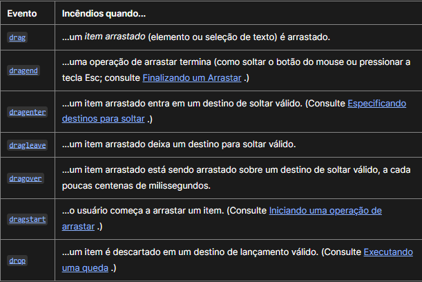

# Kaban Drag Drop 

Um projeto para entender os conceito de Drag and Drop. Neste projeto repliquei o conceito do kaban onde arrastamos os cards para cada estapa do processo da lista como ToDo(Para fazer), In Progress(Em progresso) e Done(Feito).

Passei por cada etapa do drag an drop como o dragstart que é o inicio da ação de arrastar ate o drop que é onde soltamos nosso obejo no lugar valido. Deixarei aqui uma imagem contendo a explicação de cada evento do Drag and Drop.

</img>